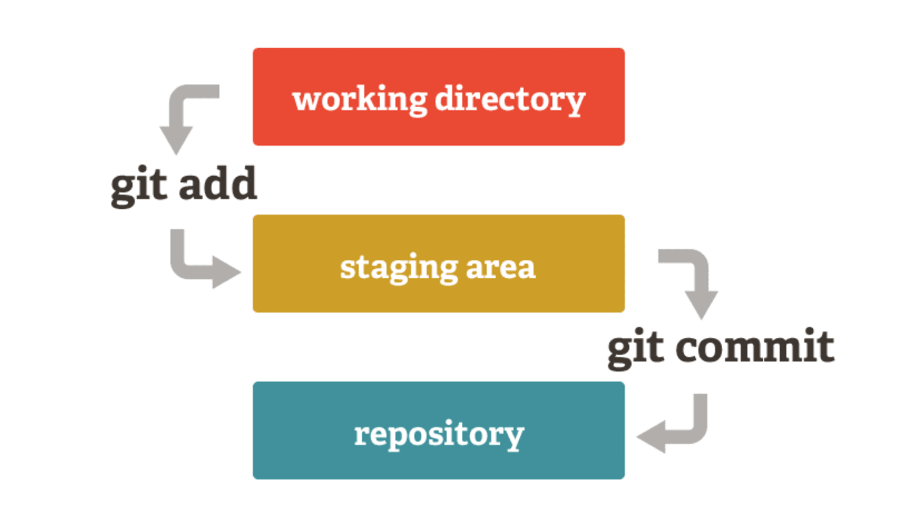
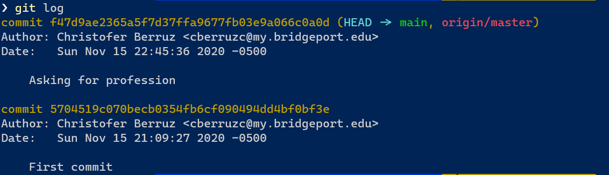

# An introduction to Git + Github

*Date:* November 16/2020

*By:* Christofer Berruz Chungata

In this tutorial, we will explore how to use git as a version control system and github as a remote repository service. You will need to code a few things in this tutorial, so please make sure to have installed git. [Download git here for your OS.](https://git-scm.com/downloads)

If you want to dive deeper I recommend [Atlassian Git tutorial](https://www.atlassian.com/git/tutorials), which goes over how to use `git` in detail.

To have an appreciation for `git`, I recommend reading [The Git Parable](https://tom.preston-werner.com/2009/05/19/the-git-parable.html). It is nice reading that open your eyes on how one might design `git`.

You can also checkout [the official git documentation](https://git-scm.com/doc).

## Git

### What is Git

Git is a **version control** system that allows you to keep snapshots, or commits of your code across time. Moreover, it allows teams to collaborate on the same codebase or **repository**. Usually this repository is hosted on the internet for people to clone it and interact with it (we call this a **remote repo**). Before Git, another popular version control system was Apache Subversion (SVN).

The main difference between Git and SVN is that when cloning a git repo, one gets the *entire* codebase. One is also able to create commits **locally**, and later sync them with the remote. This allows you to continue working on the codebase without an internet connection.

### How does git work

There are basically two main concepts to master (pun intended) in git: commits and branches.

> Branches are a more advanced topic, so we will only focus on the `master` branch and how to deal with commits.

To illustrate this, we will work by example. We will develop a python application called `chatbox`

### Making your first commit

Create a folder name `chatbox`.

Go to the folder an initiate a git repository using the following command: `git init`

Let's create a file named `main.py`

Put the following contents inside the `main.py`

```python
def main():
    username = input("What is your name? ")
    greeting = "Welcome {}!".format(username)
    print(greeting)

if __name__ == '__main__':
    main()
```

Now, let's type `git status` to see what has changed in our repository.


By default, the repository points to the **master** branch. We have not commited anything yet, so it shows no commits yet. Moreover, it shows `main.py` as an *untracked* file. You have to explicity tell git which files you want to track (see its changes).

How do we track a file? You will have to add the file to a commit at least once. After that, git automatically tracks its changes.

Now, how do we make a commit? Commits is a two step process: **stage** and **commit**. You might wonder, why? The reason is that having a a working tree, a staging area, and repository provides more flexibility in making a commit.

> ***Sidenote***: I would recommend you google the concept of **cherry-picking** in git to have an idea on how important is to know how to make good commits.

This two step process can be nicely represented in this graph:



To **stage** a file, just type `git add <filename>`. For example, let's stage `main.py` by typing `git add main.py`


You see that if we type `git status` again, it now shows that the contents of `main.py` have changed.

Let's finally make a **commit**. Just type `git commit -m <message>`. In our case, we will type `git commit -m "First commit"`


Congratulations, you have made your first commit!

### Working with the staging area

Let's create a folder called `helper_classes`. Let's create two files inside the `helper_classes` folder: `Person.py` and `Profession.py`. We will leave them empty.

Let's also add the following contents to `main.py`.

```python
profession = input("What is your profession? ")
```

Your file `main.py` should look like this:

```python
def main():
    username = input("What is your name? ")
    greeting = "Welcome {}!".format(username)
    print(greeting)
    profession = input("What is your profession? ")

if __name__ == '__main__':
    main()
```

Now, let's do a `git status` and see what happens.


**For tracked files** we always have two options: either add it to the staging area, or restore it. If you read the output of the command line it will be self explanatory but let's discuss it.

`git restore <filename>` discards all the changes made since the last commit. Useful for when you made changes, now you have a bug, and you want to simply go back and start from scratch.

Every **new file** or **not previously commited file** will appear in the *untracked files* sections. This also includes folders. We can simply add all the folder by typing `git add <foldername>`.

However, what if we will like to ignore certaing files or folders? We use a file named `.gitignore`

#### Useful stage commands

`git add -u` Adds all files that are being tracked to the next commit

`git add .` Adds all files, both tracked **and untracked** to the next commit

`git restore <filename>` Discard changes and goes back to commited version

`git restore --staged <filename>` Moves a file from the staged area back to the working tree

### The famous `.gitignore` file

In most cases, our code might produce output that we will like to save: logging files, images, text, etc. However, the philosophy of version control systems is that your code is able to *produce* those outputs. Hence, why to save the *output* files if you can *recreated them* by running your code? We will like to ignore those files.

Let's create a file named `.gitignore`. The contents of this file are **path** or **expressions** that represent what to ignore.

Let's ignore all contents in the `helper_classes` folder. The contents of your `.gitignore` file should be this:

```text
helper_classes/
```

Now, if we do a `git status` again, we will see that the folder `helper_classes/` does no longer appear under the *untracked files* section.


**Question:** Can you ignore the `.gitignore` file? No.

#### A word on `.gitignore`

The contents of the `.gitignore` file are a form of **regular expressions**. As such, `*.log`, untracks all files ending in `.log` extension.

## Github

So far, our repo has been stored **locally**. But, we will like to share our awesome `chatbox` application with the world! To do that, we use a **remote hosting** service. Github is the most widely known, but one can also use Bitbucket as an example.

### Creating a Github repository

Let's create a github repository to share our code. Go to github and create an empty repository call chatbox.


**Click on create repository.**

You will see a page similar to this one:


**Let's examine each piece.**

Remember that I mentioned that remote repositories are hosted on the internet? Well, look at `https://github.com/ChristoferBerruz/chatbox.git`. This is basically the address of the remote repository.

>**Note:** The username will be replaced by your username.

Moreover, Github is telling us to execute the following commands in our **local command line**:

```text
git remote add origin https://github.com/ChristoferBerruz/chatbox.git
git branch -M main
git push -u origin main
```

What does this all mean? Simple. In our **local** git repo, we have to **add a remote**. We add a remote by simply typing `git remote add <desired_name_of_remote> <link_to_remote>`.

It is convention to name our main remote `origin`, but you can name it whatever you want.

Github is also asking us to *change the name* of our current to the `main` branch by typing `git branch -M main`. In general, the command is `git branch -M <new_name_of_branch> <old_name_of_branch>`.

We do not have to use that command if we like to keep the name as `master`.

>**Note**: Due to the Black Lives Matter movement, git decided to change its name `master` to `main` a couple of months ago. Hence, `main` and `master` are synonyms in most tutorials you will see online.

`git push -u origin main` pushes the changes to the remote repository. The flag `-u`, short for `--set-upstream`, makes your current branch *track* the `main` branch from the remote repository named `origin`.

Uf! That was a lot. Try to re-read this paragraph if that is not still clear.

#### Remote - local repo sync commands

`git branch` Shows the current branch you are working on

`git branch -vv` Shows which local branch is tracking which branch in which remote

`git push <branch_name> <remote_name> <branch_in_remote>` is a more general command. When we do `git push origin master` the `<branch_name>` is defaulted to the branch you are currently working

`git push` is a shortcut that you can do after your first `git push -u origin master`.

#### Cloning a repo

The simple command `git clone <remote_repo_address>` makes a local repo of the repository. Note that `<remote_repo_address>` can be *any* remote repo: a Github link, a Bitbucket link, or even an IP address.

If you will like to clone *my* amazing `chatbox` application you will use `git clone https://github.com/ChristoferBerruz/chatbox.git`. Try it out!

>**Remember:** you do not have to make a folder for the repo you want to clone. When you clone a repo, `git clone` creates a folder in your current directory.

## Git + github

Now, let's dive into some useful concepts to work with git and github at the same time.

### Synchronization: the fun part

Okay, this is the interesting / confusing part. Let us rememeber a couple of things before we proceed.

1. You do not immediately see changes made by other people.
2. Your changes are not seen by other people until you `push`.

As a result, our **local** and **remote** respository need to be manually **synchronized**.

How do we do that? By *pushing* and *pulling*.

If you want to make other people see your changes, you `push`.
If you want to see what changes were made, that is trickier.

There are two main approaches to get the updates made in the remote repo by other people.

First, we can use `git pull` to see and apply the changes made by other people.
Second, we can use `git fetch` to see what changes other people made. Then, we use `git rebase` to apply those changes in our **local** branch. I personally use the second approach, and you are welcome to dive into the difference between them.

### Changing history: `git rebase`

This is the last section of this small tutorial. Brace tight, we are about to finish! Once you master rebasing, you will be an expert in `git`.

**What is rebasing?**

To answer that question, I will briefly say that commits are stored in a tree structure under the hood. The rules that govern the tree are the following:

1. Each node has a parent node.
2. Ideally, there is only one root node.
3. A branch is simply an extra pointer to a particular node.

Because it is a tree-like structure, we can move and merge nodes. This is rebasing.

Why will you ever need rebasing? Because we are humans and we might make mistakes in writting our commits (we introduced a bug and we do not want that in our history), or we realized that two commits should have been one rather than two.

We can check that *history* by simply typing `git log`.



Each commit has a *hash* number. We can get the short version of the hash by typing `git log --oneline`.


The interesting part is that the hash number is calculated using the following:

1. The contents of the changes in the files added to the commit
2. The datetime of the commit
3. The author of the commit
4. The parent node of the commit (previous commit).

Here is the result: if while rebasing you change **any** of those 4 things, the hash of the commit will change. Moreover, by clause 4, a change in a commit higher in tree (older commit) will cause newer commits to also change its hash! The oldest past we want to change, the more history we re-write!

I will not go over in depth in rebasing, but here is a birdseyer view on how to do it.

We go into rebase mode by typing:

`git rebase -i <commit_pointer>~<number_of_commits>`. The most current commit is usually pointed by `HEAD`

You will see a screen like this:


Google the options and check what exactly each commmand does. For more information, I recommend reading Atlassian articles in git. [Atlassian Git tutorial](https://www.atlassian.com/git/tutorials).

Particularly for rebasing (which is an advanced topic) [check out this article.](https://www.atlassian.com/git/tutorials/merging-vs-rebasing)